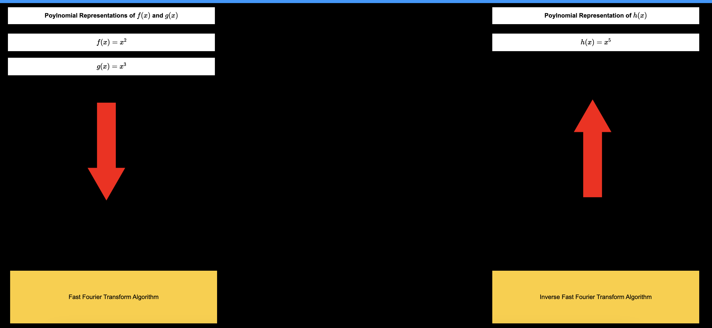
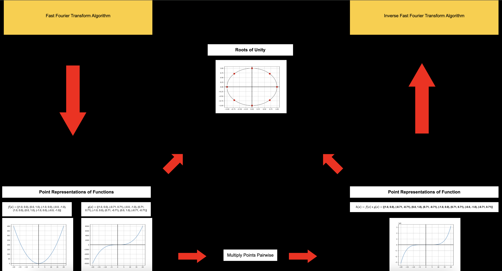

# FFT/IFFT RESTful API

This RESTful API performs function multiplication using the Fast Fourier Transform (FFT) and Inverse Fast Fourier Transform (IFFT). Users can send two input functions, and the API computes their product efficiently in the frequency domain using FFT, then transforms the result back using IFFT. Additionally, this project includes a randomizer microservice, which generates random polynomial functions that can be used as input for FFT multiplication.

### Features:
- Accepts two input functions via API request
- Uses FFT for efficient function multiplication
- Returns the final result using IFFT
- Built for high-speed computation
- Randomizer Microservice: Generates random polynomial functions on request





### Directions for clean install
```python
# Start the project by creating a virtual environment:
$ python3 -m venv venv

# Activate the venv
$ source venv/bin/activate

# Install dependencies
$ pip3 install -r requirements.txt

#  Run Project
$ make run
```

---

### Directions for Sending Requests & Receiving Responses via API

**API Overview**

The API endpoint accepts two input parameters, **input_1** and **input_2**, which should be polynomial functions of the variable x. The server processes the inputs using the **FFT/IFFT algorithm** to compute their product and returns a **polynomial function** in JSON format.

**1. Sending an HTTP GET Request**
	• The API endpoint requires two parameters:
		• **input_1**: First polynomial function
		• **input_2**: Second polynomial function
	• **Important Notes:**
		• Inputs must be polynomial functions of x; otherwise, a **400 Bad Request** error will occur.
		• Use ^ or URL-encoded notation for exponents (x^2 or x%5E2).
		• If using longer expressions, **URL encoding is required**:
			• ^ → %5E
			• Space → %20
			• + → %2B
			• - → %2D
			• * → %2A
	• Reference: [URL Encoding Guide](https://www.tutorialspoint.com/html/html_url_encoding.htm)
           
**2. Example API requests:**
- Example 1: **Basic Polynomial Multiplication**
```bash
curl --location 'http://localhost:63861/api/v1.0.0/calculate?input_1=x^3&input_2=x^5'
```
- HTTP GET Request info:
	- Host: "http://localhost:63861"
	 - Port: "63861"
	 - Path: "/api/v1.0.0/calculate?"
	 - Params: {
		 - input_1: "x^3"
		 - input_2: "x^5"}
```python
# Sending request via python
url = 'http://localhost:63861/api/v1.0.0/calculate?input_1=x^3&input_2=x^5'
send_request(url)
```

           
- Example 2: **Using URL Encoding for Complex Polynomials**
```bash
curl --location 'http://localhost:63861/api/v1.0.0/calculate?input_1=x%5E2%2B2*x%5E5&input_2=x%5E5'
```
- **HTTP GET Request Details:**
	- Host: http://flip1.engr.oregonstate.edu
	- Port: 63861
	- Path: /api/v1.0.0/calculate
	- Parameters: { 
		- "input_1": "x%5E2%2B2*x%5E5",
		- "input_2": "x%5E5"}
```python
# Sending request via python
url = 'http://localhost:63861/api/v1.0.0/calculate?input_1=x%5E2%2B2*x%5E5&input_2=x%5E5'
send_request(url)
```

**3. Receiving the API Response**
- The API returns a JSON response containing the computed polynomial product under the key "result".
- To process the response in Python:
```python
response = send_request(url)  # Send request
response = response.json()    # Convert to JSON format
answer = response["result"]   # Extract computed polynomial
```
- Example JSON Response
```python
{
  "result": "x^8 + 2x^10"
}
```
---
### Documentation
- API Documentation [Postman](https://documenter.getpostman.com/view/23973343/2sAYdoG8FL)  
- UML sequence diagram via [Lucidchart](https://lucid.app/lucidchart/4f7f271f-dfd9-4e4d-8098-d71a9c222b90/edit?invitationId=inv_58bf306c-930f-43db-af31-113b6fc7357f&page=0_0#)


